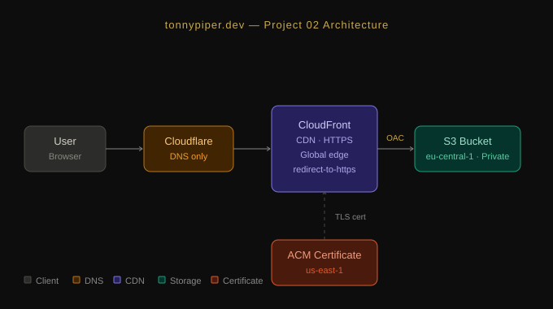

# Portfolio Website — AWS Static Hosting + CI/CD Pipeline

## What it does

This project hosts a static personal portfolio website on AWS with global CDN delivery, HTTPS enforcement, and a custom domain. The site is trilingual (EN/FR/DE) with dark/light theme support.

**NEW in Project 3:** Full CI/CD automation — every push to GitHub automatically deploys to production in ~2 minutes.

## Architecture

**Project 2 — Static Hosting:**


**Project 3 — CI/CD Pipeline:**


## AWS Services Used

**Core Infrastructure (Project 2):**
- S3 — Static website hosting
- CloudFront — Global CDN with HTTPS
- ACM — SSL/TLS certificate
- IAM — Bucket policies and service roles
- Route 53 / Cloudflare — DNS management

**CI/CD Pipeline (Project 3):**
- CodePipeline — Orchestrates automated deployments
- CodeBuild — Executes build and deployment commands
- CloudWatch — Build logs and monitoring
- Secrets Manager — Secure GitHub token storage

## Deployment Flow (Automated)

git push → GitHub webhook → CodePipeline triggers → CodeBuild runs buildspec.yml → S3 sync → CloudFront invalidation → Live in ~2 minutes

## Project Structure
```
aws-static-portfolio/
├── website/                  # Website files
│   ├── index.html           # Main page
│   ├── error.html           # 404 page
│   └── assets/              # Images, fonts, etc.
├── infrastructure/          # Terraform configs (Project 4)
├── deployment/              # Manual deployment scripts (Project 2)
├── buildspec.yml            # CodeBuild instructions
├── architecture-diagram.svg # Architecture visualization
└── README.md
```

## How to Deploy Changes

**Automated (Project 3 — Current):**
1. Edit files in website/
2. Commit and push:
   git add .
   git commit -m "Update content"
   git push origin main
3. Wait ~2 minutes — pipeline auto-deploys

**Manual (Project 2 — Legacy):**
For emergency deployments or local testing:
bash deployment/deploy.sh

## buildspec.yml

CodeBuild executes these commands on every deployment:

- aws s3 sync website/ s3://BUCKET_NAME --delete
- aws cloudfront create-invalidation --distribution-id DISTRIBUTION_ID --paths "/*"

## Infrastructure Setup

**S3 Bucket:**
- Website hosting enabled
- Bucket policy allows CloudFront OAC access
- Region: eu-central-1

**CloudFront Distribution:**
- Origin: S3 bucket via Origin Access Control (OAC)
- Custom domain with ACM certificate (us-east-1)
- Default root object: index.html

**CodePipeline:**
- Source: GitHub (main branch)
- Build: CodeBuild project
- Artifact storage: S3 bucket for pipeline artifacts

**IAM Roles:**
- CodeBuild service role — S3, CloudFront, CloudWatch, Secrets Manager access
- CodePipeline service role — GitHub, CodeBuild, S3 artifact access

## Prerequisites

- AWS CLI installed and configured
- AWS account with appropriate IAM permissions
- Domain registered with DNS provider
- GitHub account with repository access

## Links

- Live Site: https://tonnypiper.dev
- GitHub: https://github.com/TonnyPiperDev/aws-static-portfolio

## Author
Build while studying for AWS Solutions Architect Associate (SAA-C03) - April 2026

Tonny Piper | https://github.com/TonnyPiperDev


